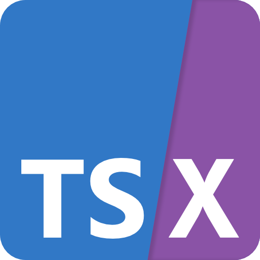
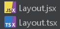

# Unofficial JSX and TSX logos

Here's two unofficial logos for the `.jsx` and `.tsx` file formats :

## JSX logo

## TSX logo

## But why ?

If you're somewhat like me, you like having correct icons of file formats next to file lists in your IDE.

And if you're *even more* like me, you've been bothered by the fact that there's no specific icon for `.jsx` and `.tsx` files.
So this is my attempt at making one for these.

Both logos are heavily inspired by [the OpenJSX logo](https://github.com/OpenJSX/logo), except the text is larger here for a better legibility on small formats.

## Usage example

This is how it looks like on my IDE with [Extra Icons](https://plugins.jetbrains.com/plugin/11058-extra-icons) :

